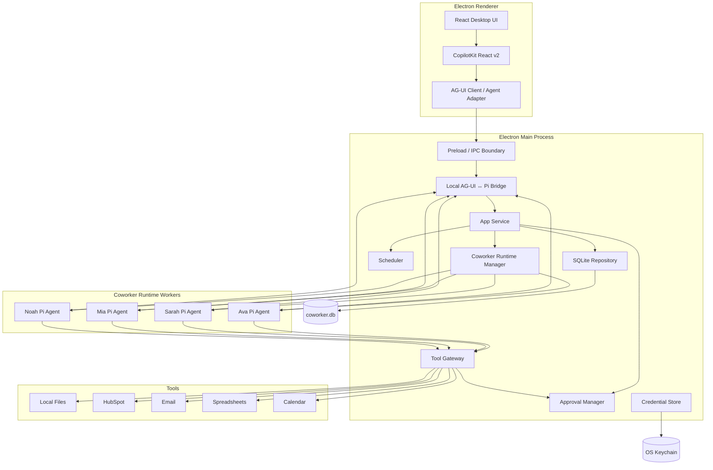
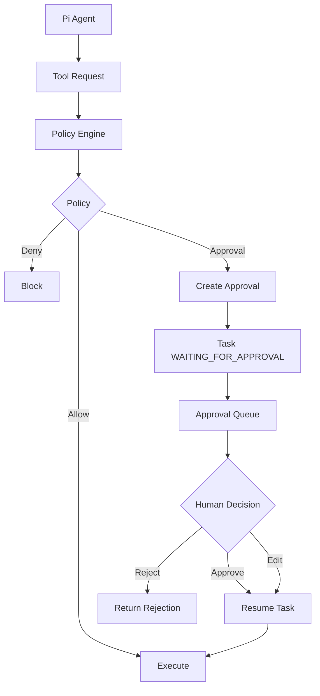
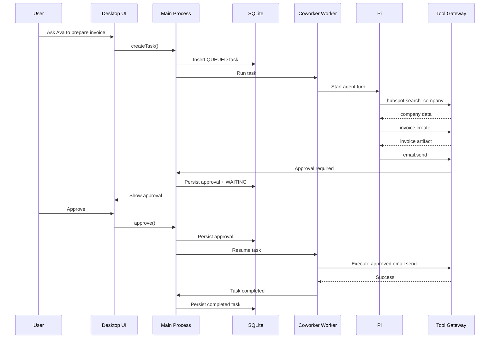

# Coworker Desktop App — Architecture & Implementation Plan

**Status:** Proposed architecture  
**Product type:** Installable desktop application  
**Runtime model:** Local-first, SQLite-backed, Pi embedded as the agent library  
**Deployment:** No Docker, no server required for the core app

---

# 1. Executive summary

This version of the product should be much simpler than the hosted multi-tenant architecture.

The application is a **standalone desktop AI coworker app** that users install on their own computer. The app stores its state locally in SQLite, runs Pi locally as a library, and gives each coworker its own agent runtime so multiple coworkers can work independently and in parallel.

The core architecture becomes:

```text
Desktop App
   │
   ├── React + CopilotKit Agent UI
   │       └── AG-UI event layer
   │
   ├── SQLite
   ├── Scheduler
   ├── Approval Queue
   ├── Tool / Integration Layer
   └── Coworker Runtime Manager
           │
           ├── Ava → Pi Agent
           ├── Sarah → Pi Agent
           ├── Mia → Pi Agent
           └── Noah → Pi Agent
```

CopilotKit is the **agent-facing UI library**, while our own application shell still owns coworker navigation, task queues, schedules, approvals, activity, settings, and desktop-specific UX.

The product should therefore use CopilotKit selectively:

```text
CopilotKit
  ├── agent conversation UI
  ├── streaming responses
  ├── tool-call rendering
  ├── generative UI
  ├── shared agent/app state
  └── human-in-the-loop interaction components

Our UI
  ├── Home
  ├── Coworkers
  ├── Approval Inbox
  ├── Schedules
  ├── Activity
  ├── Integrations
  └── Settings
```

There is no Docker, Kubernetes, Redis, Postgres, cloud control plane, or separate execution service.

For the first version, the app should focus on a few things and do them well:

1. Create and configure AI coworkers.
2. Give each coworker its own Pi runtime.
3. Let coworkers run tasks independently.
4. Persist all tasks and history in SQLite.
5. Let coworkers use controlled local and API tools.
6. Queue consequential work for human approval.
7. Run scheduled work while the desktop app is running.
8. Recover cleanly after app restarts.

The main product experience should feel like managing several local AI coworkers, not configuring an agent framework.

---

# 2. Recommended desktop stack

Because Pi and CopilotKit are TypeScript/JavaScript friendly, the recommended desktop stack is:

```text
Electron
React
TypeScript

CopilotKit React v2
AG-UI

Pi Agent Core
SQLite

Node.js worker_threads
```

Recommended supporting libraries:

```text
Electron
React
Vite
TypeScript

@copilotkit/react-core/v2
@ag-ui/client
@ag-ui/core

better-sqlite3
drizzle-orm or direct SQL

node:worker_threads
cron-parser

Electron safeStorage
or keytar

zod
```

Optional later:

```text
TanStack Query
Zustand
sqlite-vec
FTS5
electron-updater
```

## Why CopilotKit

CopilotKit should be the UI layer for interactions with each coworker.

Its useful primitives for this product include:

```text
CopilotChat / chat primitives
Headless UI hooks
useAgent
tool rendering
generative UI
shared state
human-in-the-loop
interrupt handling
agent capability discovery
```

We should **prefer the headless/custom UI approach** for the main coworker experience so the product does not look like a generic chatbot.

CopilotKit can still handle the difficult agent-UI mechanics underneath:

```text
streaming text
agent status
tool events
structured tool output
interactive approval cards
message state
agent events
```

while we retain full visual control over the desktop experience.

## Why Electron

Electron is a practical fit because the app needs:

- a desktop UI
- Node.js access
- direct use of Pi as a JavaScript/TypeScript library
- local filesystem access
- SQLite access
- worker threads
- OS integrations
- packaging for Windows/macOS/Linux

A Tauri application could also work, but using Pi would normally require a Node sidecar or a separate runtime process. That makes the architecture more complicated for little benefit in the first version.

For this product, **Electron keeps Pi inside the same application stack**.

---

# 3. High-level architecture



The Electron main process is the local control center.

The React renderer never talks directly to SQLite, Pi, filesystem APIs, or credentials.

---

# 5. CopilotKit + Pi integration model

CopilotKit is not the agent runtime.

Pi remains the agent runtime.

The separation is:

```text
CopilotKit
    =
Agent UX

AG-UI
    =
Agent ↔ UI event contract

Pi
    =
Reasoning + tool-use runtime

SQLite
    =
Durable application state
```

This distinction is important.

We should not move task state, schedules, approvals, or durable business state into CopilotKit.

## 4.1 AG-UI bridge

CopilotKit speaks to agents through the AG-UI model.

Pi does not natively become our application UI simply because it is embedded locally, so we should create a thin adapter:

```text
PiAgentAGUIAdapter
```

Conceptually:

```ts
class PiAgentAGUIAdapter {
  run(coworkerId, input) {
    // send task to the coworker's Pi worker

    // translate Pi/runtime events into AG-UI events:
    // RUN_STARTED
    // TEXT_MESSAGE_START
    // TEXT_MESSAGE_CONTENT
    // TEXT_MESSAGE_END
    // TOOL_CALL_START
    // TOOL_CALL_END
    // TOOL_CALL_RESULT
    // STATE_DELTA
    // RUN_FINISHED
  }
}
```

The adapter translates:

```text
Pi Runtime Events
        ↓
AG-UI Events
        ↓
CopilotKit
        ↓
React UI
```

and user interaction in the other direction:

```text
CopilotKit UI
        ↓
AG-UI input / response
        ↓
Local bridge
        ↓
CoworkerRuntimeManager
        ↓
Pi Agent
```

## 4.2 Keep the connection local

This is still a standalone application.

There is no external agent server.

The preferred architecture is:

```text
Renderer
   ↓
CopilotKit / AG-UI adapter
   ↓
Electron preload IPC
   ↓
Main process
   ↓
Pi worker thread
```

If a CopilotKit integration path requires HTTP/SSE, an alternative is an **internal loopback endpoint** bound only to `127.0.0.1` and packaged inside the desktop application:

```text
CopilotKit
   ↓
127.0.0.1 local AG-UI endpoint
   ↓
Electron main process
   ↓
Pi worker
```

That is still a standalone local application, not a cloud deployment.

However, the direct IPC bridge is preferable if CopilotKit's production integration path supports the required agent registration without licensing or runtime constraints.

**Before implementation, verify the production licensing/availability of CopilotKit's direct self-managed agent registration.** Current CopilotKit documentation distinguishes production self-managed agents from development-only local agent registration.

## 4.3 Why headless CopilotKit UI is preferred

The desktop product should not primarily look like:

```text
┌─────────────────────┐
│ Generic AI Chat     │
│                     │
│ How can I help?     │
└─────────────────────┘
```

Instead:

```text
Ava — Accounting Coworker
● Working

Current task
Prepare Acme invoice

[structured agent work]

Needs approval
Send invoice — $1,800

[Review]

─────────────────────
Message Ava...
```

Use CopilotKit's lower-level/headless primitives for:

```text
messages
streaming
tool rendering
agent status
generative components
HITL interactions
```

and compose them into our own coworker-focused layout.

## 4.4 Generative UI

Generative UI is particularly useful for structured coworker outputs.

Instead of rendering everything as prose:

```text
Ava:
I created an invoice for Acme...
```

the agent UI can render:

```text
┌────────────────────────────────┐
│ Invoice Draft                  │
│                                │
│ Acme Ltd                       │
│ 12 hours × $150                │
│                                │
│ Total                 $1,800   │
│ Due                    14 days │
│                                │
│ [Open Invoice]                 │
└────────────────────────────────┘
```

Useful typed components include:

```text
InvoiceCard
EmailDraftCard
LeadSummaryCard
MeetingBriefCard
SpreadsheetArtifactCard
TaskProgressCard
ApprovalCard
ErrorCard
```

CopilotKit should render these from known tool/action events rather than giving the model arbitrary HTML.

## 4.5 CopilotKit human-in-the-loop versus platform approvals

CopilotKit provides human-in-the-loop UI primitives.

We should use those UI primitives, but **our SQLite approval system remains authoritative**.

The distinction is:

```text
CopilotKit HITL
    =
How approval is presented and answered in the UI

SQLite Approval Manager
    =
Whether the action is authorized and whether execution may proceed
```

Therefore:

```text
Pi asks for gated tool
      ↓
Policy Engine
      ↓
SQLite approval created
      ↓
AG-UI approval/interrupt event
      ↓
CopilotKit renders ApprovalCard
      ↓
Human clicks Approve
      ↓
IPC
      ↓
Approval Manager updates SQLite
      ↓
Task resumes
```

Never make a React component callback the only record that approval happened.

## 4.6 CopilotKit capability mapping

The desktop agent adapter should declare only capabilities we actually support.

Initially:

```text
streaming               YES
tools                   YES
tool rendering          YES
human approval          YES
shared state            LIMITED
generative UI           YES
sub-agents              NO
code execution          NO
sandboxed execution     NO
```

This lets the UI reflect real runtime capabilities instead of advertising features Pi/the desktop app does not implement.

---

# 5. Core architectural principle

The most important rule is:

> **Each coworker owns an independent Pi agent runtime, but the desktop application owns the durable state.**

For example:

```text
Ava
Accounting Coworker
       │
       └── Pi Agent A

Sarah
Sales Coworker
       │
       └── Pi Agent B

Mia
Support Coworker
       │
       └── Pi Agent C
```

These agents can work at the same time.

But their durable state is stored in SQLite:

```text
coworkers
tasks
messages
tool_calls
approvals
schedules
artifacts
activity
```

The Pi agent instance itself should never be the only place that important state exists.

---

# 6. Concurrency model

Each coworker should have its own runtime worker.

Recommended implementation:

```text
Electron Main Process
       │
       └── CoworkerRuntimeManager
               │
               ├── WorkerThread[Ava]
               │       └── Pi Agent
               │
               ├── WorkerThread[Sarah]
               │       └── Pi Agent
               │
               └── WorkerThread[Mia]
                       └── Pi Agent
```

## Why separate worker threads

This gives several benefits:

- one coworker cannot block the desktop UI
- multiple coworkers can work at the same time
- each coworker keeps independent conversation/runtime state
- a failed worker can be restarted without restarting the entire app
- the main process remains responsible for durable state and policy

## Coworker concurrency

For V1, use:

```text
1 active task per coworker
```

Different coworkers can run in parallel:

```text
Ava    → task A
Sarah  → task B
Mia    → task C
```

But two tasks for Ava are queued:

```text
Ava queue

Task 1 → RUNNING
Task 2 → QUEUED
Task 3 → QUEUED
```

This avoids race conditions with:

- conversation state
- workspace state
- tools
- files
- business context

Later, a coworker could support concurrency greater than one by creating temporary task-specific Pi sessions.

That should not be part of V1.

---

# 7. Runtime Manager

The `CoworkerRuntimeManager` is one of the most important internal components.

Responsibilities:

```text
start coworker runtime
stop coworker runtime
restart crashed runtime
send task to coworker
receive agent events
pause/resume tasks
track runtime status
```

Conceptually:

```ts
interface CoworkerRuntimeManager {
  start(coworkerId: string): Promise<void>;
  stop(coworkerId: string): Promise<void>;

  enqueueTask(
    coworkerId: string,
    taskId: string
  ): Promise<void>;

  restart(coworkerId: string): Promise<void>;
}
```

Runtime state:

```text
STOPPED
STARTING
IDLE
WORKING
WAITING_FOR_APPROVAL
ERROR
```

The UI can display these states directly.

Example:

```text
Ava
Accounting Coworker

● Working

Current task:
Prepare Acme invoice
```

---

# 8. Pi agent lifecycle

A Pi agent belongs to one coworker runtime.

When the runtime starts:

```text
Load coworker
      ↓
Load instructions
      ↓
Load enabled tools
      ↓
Load model configuration
      ↓
Load recent conversation/task context
      ↓
Create Pi Agent
      ↓
Wait for work
```

When a task arrives:

```text
Task
  ↓
Pi Agent
  ↓
Reason
  ↓
Tool call
  ↓
Tool result
  ↓
Continue reasoning
  ↓
Result / Approval / Failure
```

The worker emits structured events back to the main process:

```text
agent.started
agent.message
tool.requested
tool.completed
approval.requested
task.completed
task.failed
```

The main process persists these events to SQLite.

---

# 9. Durable state vs runtime state

The app must survive:

- app restart
- computer reboot
- worker crash
- model API failure
- approval being delayed for hours

Therefore:

```text
Pi memory = temporary runtime state

SQLite = durable application state
```

Important data is persisted before the app considers a step complete.

Examples:

```text
task created
task started
tool requested
approval requested
approval decided
external action completed
task completed
```

The runtime can then be reconstructed from SQLite when needed.

---

# 10. SQLite architecture

The application can use one database file:

```text
coworker.db
```

Recommended SQLite configuration:

```sql
PRAGMA journal_mode = WAL;
PRAGMA foreign_keys = ON;
PRAGMA busy_timeout = 5000;
```

WAL mode improves concurrency for desktop usage.

## Recommended ownership model

The safest architecture is:

> **Only the Electron main process writes directly to SQLite.**

Worker threads communicate with the main process through messages.

This avoids every Pi worker independently opening and writing to the database.

The flow becomes:

```text
Pi Worker
   ↓
event / request
   ↓
Main Process
   ↓
SQLite
```

---

# 11. Core SQLite schema

## Coworkers

```sql
CREATE TABLE coworkers (
    id TEXT PRIMARY KEY,
    name TEXT NOT NULL,
    role TEXT NOT NULL,
    description TEXT,

    system_prompt TEXT,

    model_provider TEXT NOT NULL,
    model_name TEXT NOT NULL,

    status TEXT NOT NULL DEFAULT 'active',

    created_at TEXT NOT NULL,
    updated_at TEXT NOT NULL
);
```

## Tasks

```sql
CREATE TABLE tasks (
    id TEXT PRIMARY KEY,
    coworker_id TEXT NOT NULL,

    title TEXT NOT NULL,
    input TEXT,

    status TEXT NOT NULL,

    priority INTEGER NOT NULL DEFAULT 0,

    created_at TEXT NOT NULL,
    started_at TEXT,
    completed_at TEXT,

    FOREIGN KEY(coworker_id)
      REFERENCES coworkers(id)
);
```

Suggested task states:

```text
QUEUED
RUNNING
WAITING_FOR_APPROVAL
COMPLETED
FAILED
CANCELLED
```

## Messages

```sql
CREATE TABLE messages (
    id TEXT PRIMARY KEY,
    coworker_id TEXT NOT NULL,
    task_id TEXT,

    role TEXT NOT NULL,
    content TEXT NOT NULL,

    created_at TEXT NOT NULL
);
```

## Tool calls

```sql
CREATE TABLE tool_calls (
    id TEXT PRIMARY KEY,
    task_id TEXT NOT NULL,

    tool_name TEXT NOT NULL,

    arguments_json TEXT,
    result_json TEXT,

    status TEXT NOT NULL,

    created_at TEXT NOT NULL,
    completed_at TEXT
);
```

## Approvals

```sql
CREATE TABLE approvals (
    id TEXT PRIMARY KEY,

    task_id TEXT NOT NULL,
    coworker_id TEXT NOT NULL,
    tool_call_id TEXT,

    action_type TEXT NOT NULL,
    summary TEXT NOT NULL,

    proposed_payload_json TEXT,

    risk_level TEXT,

    status TEXT NOT NULL,

    created_at TEXT NOT NULL,
    decided_at TEXT
);
```

Approval states:

```text
PENDING
APPROVED
REJECTED
EDITED
EXPIRED
```

## Schedules

```sql
CREATE TABLE schedules (
    id TEXT PRIMARY KEY,

    coworker_id TEXT NOT NULL,

    name TEXT NOT NULL,

    schedule_type TEXT NOT NULL,
    cron_expression TEXT,
    run_at TEXT,
    timezone TEXT,

    task_template_json TEXT NOT NULL,

    enabled INTEGER NOT NULL DEFAULT 1,

    last_run_at TEXT,
    next_run_at TEXT,

    created_at TEXT NOT NULL,
    updated_at TEXT NOT NULL
);
```

## Artifacts

```sql
CREATE TABLE artifacts (
    id TEXT PRIMARY KEY,

    task_id TEXT,
    coworker_id TEXT NOT NULL,

    name TEXT NOT NULL,
    mime_type TEXT,

    file_path TEXT NOT NULL,

    created_at TEXT NOT NULL
);
```

---

# 12. Local scheduler

The scheduler should be built specifically for the desktop app.

There is no need for BullMQ, Redis, or Temporal.

The scheduler runs inside the Electron main process.

Architecture:

```text
SQLite schedules
       ↓
Scheduler Service
       ↓
Find next due job
       ↓
Timer
       ↓
Create task
       ↓
Coworker queue
       ↓
Pi Agent
```

## Scheduler responsibilities

```text
create schedule
edit schedule
delete schedule
enable/disable schedule
calculate next run
detect due schedules
create tasks
handle missed schedules
```

## Timer strategy

Do not create one timer for every schedule.

Use one scheduler loop.

Conceptually:

```text
1. Load earliest next_run_at
2. Set timer
3. Timer fires
4. Query all schedules now due
5. Create tasks
6. Calculate next_run_at
7. Repeat
```

This is simple and efficient.

## Missed schedules

Desktop computers sleep and apps are closed.

The scheduler must handle this explicitly.

When the app starts or the computer resumes:

```text
query schedules
where next_run_at <= now
```

For V1, use:

```text
MISSED POLICY = RUN_ONCE
```

Example:

A schedule was supposed to run at:

```text
08:00
```

The laptop wakes at:

```text
08:47
```

The coworker runs once at 08:47.

Do not replay 47 missed jobs.

Later, support:

```text
SKIP
RUN_ONCE
RUN_ALL
```

---

# 13. Important scheduler limitation

Because this is a standalone desktop application:

> **Scheduled work can only run while the application or its background process is running.**

The simplest V1 behavior is:

```text
Close window
      ↓
App remains in system tray
      ↓
Scheduler continues
```

Recommended features:

```text
Run in background
Launch at login
System tray icon
```

If the user explicitly quits the app, scheduled coworkers stop.

A future version could install a native OS background service, but that is not required initially.

---

# 14. Approval engine

Approval should be a first-class subsystem.

The agent must never enforce approval only through its prompt.

Bad:

```text
System prompt:
"Always ask before sending email."
```

Good:

```text
Pi requests gmail.send
        ↓
Tool Gateway
        ↓
Policy check
        ↓
APPROVAL_REQUIRED
        ↓
Create approval row
        ↓
Task → WAITING_FOR_APPROVAL
```

## Approval flow



---

# 15. Approval queue UX

The desktop app should have a permanent:

```text
Approvals
```

section.

Example:

```text
Approvals                           3 pending

────────────────────────────────────────

Ava — Accounting

Send invoice to Acme Ltd

Invoice: INV-1042
Amount: $1,800
Recipient: john@acme.com

[Review] [Approve]

────────────────────────────────────────

Sarah — Sales

Send follow-up to Globex

[Review] [Approve]

────────────────────────────────────────

Mia — Support

Refund order #8421

Amount: $89

[Review] [Approve]
```

The human can also:

```text
Edit
Reject
Ask coworker to revise
```

---

# 16. Durable approval behavior

Do not depend on an in-memory Promise waiting for approval.

An approval may remain pending while:

- the app restarts
- the computer sleeps
- the coworker worker crashes
- the user decides tomorrow

Therefore the sequence should be:

```text
Pi requests gated action
      ↓
Persist tool call
      ↓
Persist approval
      ↓
Persist task state
      ↓
Worker can stop
```

When approved:

```text
Approval updated
      ↓
Task requeued
      ↓
Coworker runtime resumes/reconstructs context
      ↓
Approved action executes
      ↓
Agent continues
```

This makes approvals reliable.

---

# 17. Tool architecture

Pi should use controlled tools.

Example registry:

```text
files.create
files.read
files.list

spreadsheet.create
spreadsheet.write_rows

hubspot.search_company
hubspot.get_contacts
hubspot.update_deal

email.create_draft
email.send

calendar.list_events
calendar.create_event
```

Every tool declares:

```text
name
description
schema
risk
policy
```

Example:

```ts
interface CoworkerTool {
  name: string;

  risk:
    | "low"
    | "medium"
    | "high";

  defaultPolicy:
    | "automatic"
    | "approval"
    | "denied";

  execute(
    context: ToolContext,
    input: unknown
  ): Promise<ToolResult>;
}
```

---

# 18. Tool policies

Recommended defaults:

| Tool | Policy |
|---|---|
| Read local file | Automatic |
| Search HubSpot | Automatic |
| Read CRM contact | Automatic |
| Create document | Automatic |
| Create spreadsheet | Automatic |
| Create email draft | Automatic |
| Update CRM | Ask first or Automatic |
| Send email | Approval |
| Send invoice | Approval |
| Refund payment | Approval |
| Delete record | Denied |

The user should be able to change these per coworker later.

---

# 19. No Docker changes tool security

Because there is no sandbox container:

> **Do not expose arbitrary shell or code execution in the first version.**

Safe V1 tools:

```text
local files
structured document creation
spreadsheet creation
HubSpot APIs
email APIs
calendar APIs
HTTP integrations through controlled adapters
```

Avoid initially:

```text
run_shell
run_python
execute_code
arbitrary_http_request
```

If code execution is added later, it should be considered a separate security feature.

The desktop product does not need it to prove the coworker concept.

---

# 20. Local file access

The desktop app can give coworkers access to user-approved folders.

Example:

```text
Ava workspace

~/Documents/Coworker/Ava
```

or a user-selected folder.

Pi should not automatically receive unrestricted access to the entire filesystem.

Recommended file permissions:

```text
Coworker workspace       read/write
User-selected folders    read or read/write
Everything else          unavailable
```

Example tool:

```text
files.read({
  path: "customers/acme.csv"
})
```

The Tool Gateway resolves it against allowed roots.

Block path traversal such as:

```text
../../...
```

---

# 21. Spreadsheet generation

Because this is a local app, spreadsheet creation is straightforward.

Example:

```text
Pi
 ↓
spreadsheet.create
 ↓
ExcelJS / similar library
 ↓
.xlsx file
 ↓
Coworker workspace
 ↓
Artifact record in SQLite
```

Pi does not need direct access to ExcelJS.

It uses structured tools:

```text
spreadsheet.create
spreadsheet.add_sheet
spreadsheet.write_rows
spreadsheet.set_formula
spreadsheet.save
```

This keeps spreadsheet output deterministic and auditable.

---

# 22. External integrations

External integrations run directly from the desktop application.

Example:

```text
Pi Agent
   ↓
hubspot.get_company
   ↓
Tool Gateway
   ↓
HubSpot Adapter
   ↓
HubSpot API
```

No server is required.

The same model applies to:

```text
Gmail
Microsoft Graph
HubSpot
Xero
QuickBooks
Google Drive
Slack
```

---

# 23. Credential storage

Do **not** store plain OAuth tokens in SQLite.

Use the operating system's secure credential store.

Recommended:

```text
Electron safeStorage
```

or:

```text
keytar
```

Flow:

```text
SQLite integration record
       ↓
credential_key
       ↓
OS Keychain
       ↓
encrypted access token
```

Pi never receives the raw credential.

The integration adapter receives it only when executing a tool.

---

# 24. Electron security

Recommended Electron settings:

```text
contextIsolation: true
nodeIntegration: false
sandbox: true for renderer
```

Use a small preload API.

Renderer:

```text
window.coworker.tasks.create(...)
window.coworker.approvals.approve(...)
```

The renderer should never receive unrestricted:

```text
fs
child_process
SQLite handle
credential store
Node APIs
```

All privileged work stays in the main process.

---

# 25. Main-process architecture

Recommended modules:

```text
main/
├── app/
├── db/
├── runtime/
├── scheduler/
├── approvals/
├── tools/
├── integrations/
├── artifacts/
├── security/
└── ipc/
```

The main process acts as the local application backend.

It replaces the cloud API/control-plane architecture from the hosted design.

---

# 26. Suggested monorepo

```text
coworker/
│
├── apps/
│   └── desktop/
│       ├── src/
│       │   ├── main/
│       │   │   ├── app/
│       │   │   ├── db/
│       │   │   ├── runtime/
│       │   │   ├── scheduler/
│       │   │   ├── approvals/
│       │   │   ├── tools/
│       │   │   ├── integrations/
│       │   │   ├── artifacts/
│       │   │   ├── security/
│       │   │   └── ipc/
│       │   │
│       │   ├── preload/
│       │   │
│       │   └── renderer/
│       │       ├── components/
│       │       ├── pages/
│       │       ├── copilot/
│       │       │   ├── provider/
│       │       │   ├── agents/
│       │       │   ├── renderers/
│       │       │   └── hitl/
│       │       ├── coworker/
│       │       ├── approvals/
│       │       ├── schedules/
│       │       └── activity/
│       │
│       └── package.json
│
├── packages/
│   ├── agent/
│   │   ├── runtime.ts
│   │   ├── pi-runtime.ts
│   │   └── ag-ui-adapter.ts
│   │
│   ├── tools/
│   ├── integrations/
│   ├── database/
│   ├── shared/
│   └── ui/
│
└── package.json
```

A smaller repository is also completely acceptable for V1.

The important boundaries are conceptual, not folder count.

---

# 27. Coworker definition

A coworker can be stored as structured configuration.

Example:

```json
{
  "name": "Ava",
  "role": "Accounting Coworker",

  "instructions": "Help prepare invoices and accounting reports.",

  "model": {
    "provider": "anthropic",
    "name": "claude-sonnet"
  },

  "tools": [
    "files.read",
    "files.create",
    "spreadsheet.create",
    "hubspot.search_company",
    "email.create_draft",
    "email.send"
  ],

  "policies": {
    "email.send": "approval"
  }
}
```

The UI should hide most of this complexity.

The user sees:

```text
Ava
Accounting Coworker

Responsibilities
✓ Prepare invoices
✓ Prepare reports
✓ Look up customers
✓ Draft customer emails

Needs approval
• Send email
• Send invoice
```

---

# 28. Creating a coworker

Recommended flow:

```text
Create Coworker
      ↓
Name + Role
      ↓
Responsibilities
      ↓
Choose model
      ↓
Enable tools / integrations
      ↓
Set approval rules
      ↓
Optional schedule
      ↓
Create
```

The app then creates:

```text
coworker row
runtime configuration
tool grants
approval rules
optional schedules
```

The runtime starts when needed.

---

# 29. Runtime startup strategy

There are two options.

## Option A — Start all coworker workers on app launch

Good for:

```text
2–5 coworkers
```

Advantages:

- instant interaction
- simple mental model
- scheduler can dispatch immediately

## Option B — Lazy start

Start a coworker worker only when:

```text
user sends task
schedule fires
event arrives
```

Advantages:

- lower memory usage
- scales to many configured coworkers

Recommended approach:

> **Use lazy start, then keep active workers warm for a period.**

For example:

```text
task arrives
    ↓
worker starts
    ↓
Pi initialized
    ↓
task runs
    ↓
worker stays idle for 15 minutes
    ↓
worker shuts down if unused
```

For the first version with only a few coworkers, keeping all active coworkers running is also reasonable.

---

# 30. Task queue

Each coworker owns a local task queue.

Example:

```text
Ava

1. Prepare Acme invoice       RUNNING
2. Generate weekly report     QUEUED
3. Reconcile customer list    QUEUED
```

The queue is stored in SQLite.

The runtime asks the main process:

```text
give me next queued task
```

The main process atomically moves it to:

```text
RUNNING
```

Then sends it to the worker.

---

# 31. Scheduler + coworker queues

Scheduled work should create normal tasks.

Do not create a separate execution path.

Example:

```text
Schedule:
Every Friday at 4 PM
Generate receivables report

        ↓

Scheduler fires

        ↓

tasks.insert(
  coworker = Ava,
  status = QUEUED
)

        ↓

Ava Runtime Manager
        ↓
Task queue
        ↓
Pi
```

This is important because:

```text
chat tasks
scheduled tasks
manual tasks
future event tasks
```

all use the same execution model.

---

# 32. Approval + coworker queues

Approval is also part of the same task state machine.

```text
QUEUED
   ↓
RUNNING
   ↓
WAITING_FOR_APPROVAL
   ↓
QUEUED / RUNNING
   ↓
COMPLETED
```

When approval is granted:

```text
approval → APPROVED
task → QUEUED
```

The coworker's runtime then resumes it.

This keeps execution consistent.

---

# 33. Example: two coworkers working in parallel

User asks:

```text
Ava:
Prepare the Acme invoice.

Sarah:
Prepare follow-ups for overdue leads.
```

The app runs:

```text
Electron Main
      │
      ├───────────────┐
      ▼               ▼

Ava Worker         Sarah Worker
Pi Agent A         Pi Agent B

      │               │
      ▼               ▼

HubSpot           HubSpot
Files             Gmail draft
Invoice
```

Ava reaches:

```text
Send invoice
```

and creates an approval.

Sarah continues working independently.

This is the main reason each coworker should have a separate Pi runtime worker.

---

# 34. Example: accounting coworker

User:

> Prepare an invoice for Acme Ltd for 12 hours at $150/hour, due in 14 days.

Flow:

```text
UI
 ↓
Create task for Ava
 ↓
Ava worker
 ↓
Pi
 ↓
hubspot.search_company
 ↓
retrieve contact
 ↓
invoice.create
 ↓
generate PDF
 ↓
email.create_draft
 ↓
email.send
 ↓
APPROVAL REQUIRED
 ↓
Approval Queue
```

The UI shows:

```text
Ava needs your approval

Send invoice to Acme Ltd

$1,800
Due in 14 days

Attachment
INV-1042.pdf

[Edit]
[Reject]
[Approve & Send]
```

After approval:

```text
task requeued
 ↓
Ava resumes
 ↓
email.send executes
 ↓
task complete
```

---

# 35. Example: scheduled coworker

Schedule:

```text
Sarah
Every weekday at 8:00 AM
Prepare overdue lead follow-ups
```

At 8:00:

```text
Scheduler
 ↓
Create task
 ↓
Sarah queue
 ↓
Pi
 ↓
HubSpot
 ↓
Prepare drafts
 ↓
Approval items
```

The user opens the app and sees:

```text
Sarah handled 12 leads.

3 emails need your approval.
```

This is the coworker experience we want.

---

# 36. UI architecture

Keep the desktop navigation small.

Recommended:

```text
Home
Coworkers
Approvals
Schedules
Activity
Settings
```

CopilotKit should live **inside the Coworker interaction surface**, not replace the application shell.

## Home

```text
Your Coworkers

Ava
Accounting
● Working

Sarah
Sales
● Idle

Mia
Support
● Waiting for approval
```

## Coworker screen

The coworker screen is where CopilotKit is most heavily used.

```text
Ava
Accounting Coworker

● Working

Current task
Prepare Acme invoice

CopilotKit-powered interaction
──────────────────────────────

You:
Prepare the Acme invoice...

Ava:
[InvoiceCard]
Acme Ltd
$1,800
Draft ready

[ApprovalCard]
Send invoice to john@acme.com?

[Review]

Message Ava...
```

Use CopilotKit headless primitives and typed renderers so agent output can appear as structured product UI instead of only chat bubbles.

## Approvals

One combined inbox for all coworkers.

## Schedules

Simple list:

```text
Sarah
Daily lead follow-ups
Weekdays · 8:00 AM

Ava
Receivables report
Friday · 4:00 PM
```

## Activity

Chronological record across coworkers.

---

# 37. What is essential for V1

## P0 — Must have

```text
Electron desktop shell
React UI
CopilotKit React v2
AG-UI ↔ Pi adapter
SQLite database
Pi integration

Coworker CRUD
One Pi worker per coworker
Task queues
Parallel coworkers

Tool registry
Local file tools
At least one useful integration

Approval queue
Approval policies

Local scheduler
Persistent schedules

Activity/history
Error handling
App restart recovery

OS credential storage
```

---

# 38. Nice-to-have after V1

## P1

```text
System tray
Launch at login
Missed schedule handling
File artifact previews
Spreadsheet generation
HubSpot
Gmail / Outlook
Calendar
Per-tool approval settings
Desktop notifications
```

## P2

```text
Local knowledge base
FTS5 search
sqlite-vec
Google Drive
Notion
Xero
QuickBooks
Slack
Teams
Workflow templates
Coworker templates
```

## P3

```text
Background native service
True execution while UI app is fully closed
Local LLM support
Advanced memory
Multi-step workflow editor
Multiple simultaneous tasks per coworker
Agent-to-agent delegation
Plugin marketplace
MCP ecosystem
```

---

# 39. What should not be in the first version

Avoid:

```text
Docker
Kubernetes
Redis
Postgres
Temporal
Cloud control plane

Visual workflow builder
Multi-agent teams
Agent delegation

Arbitrary shell
Arbitrary Python execution

Complex RAG
Vector database server

Customer accounts
Multi-tenancy
Billing system
Cloud deployment
```

This is a local desktop product.

Keep it local.

---

# 40. Recommended build phases

## Phase 1 — Desktop foundation

Build:

```text
Electron
React
CopilotKit React v2
AG-UI / local Pi adapter
SQLite
IPC
Coworker CRUD
Task CRUD
Activity
```

Exit criteria:

> User can create Ava and submit a task that is stored and displayed.

---

## Phase 2 — Pi coworker runtime

Build:

```text
PiAgentRuntime
CoworkerRuntimeManager
worker_threads
per-coworker queue
agent event stream
```

Exit criteria:

> Ava and Sarah can both run Pi tasks at the same time without freezing the UI.

---

## Phase 3 — Tools

Build:

```text
ToolRegistry
ToolGateway
files.read
files.write
artifact handling
one business integration
```

Exit criteria:

> A coworker can retrieve data and produce a useful file.

---

## Phase 4 — Approval engine

Build:

```text
PolicyEngine
approvals table
Approval inbox
pause/resume
idempotent side effects
```

Exit criteria:

> A coworker can prepare an external action, wait for approval, and safely execute it after approval.

---

## Phase 5 — Scheduler

Build:

```text
schedules table
cron parser
next_run_at
scheduler loop
missed schedule recovery
coworker task creation
```

Exit criteria:

> A coworker can perform scheduled work without the user manually prompting it.

---

## Phase 6 — Product polish

Build:

```text
system tray
launch at login
desktop notifications
better artifact previews
integration management
coworker settings
installer
auto-update
```

Exit criteria:

> The app is comfortable to install and use daily.

---

# 41. Packaging

The desktop app should produce normal installers.

Examples:

```text
Windows
Coworker-Setup.exe

macOS
Coworker.dmg

Linux
Coworker.AppImage
```

Use:

```text
Electron Forge
```

or:

```text
electron-builder
```

Later requirements include:

```text
code signing
macOS notarization
auto updates
release channels
```

These are packaging concerns, not core runtime architecture.

---

# 42. Local data location

Use Electron's standard user-data directory.

Conceptually:

```text
<AppData>/Coworker/
    coworker.db

    artifacts/
        ava/
        sarah/

    logs/
```

Do not place application state inside the installation directory.

The app should expose:

```text
Open data folder
Backup database
Restore backup
```

later.

---

# 43. Backup strategy

Because everything is local, backup matters.

Simple V1 backup:

```text
SQLite backup API
+
artifacts directory
```

Create:

```text
Coworker-Backup-2026-08-23.zip
```

Later support automatic daily backup.

---

# 44. Crash recovery

On startup:

```text
1. Open SQLite
2. Run migrations
3. Find tasks with RUNNING status
4. Mark them RECOVERING or QUEUED
5. Recreate coworker runtimes
6. Recalculate schedules
7. Resume eligible work
```

Do not assume a task marked `RUNNING` actually has a live worker after restart.

A clean rule for V1:

```text
RUNNING at startup
      ↓
QUEUED
```

unless it was waiting for approval.

---

# 45. Recommended data flow



---

# 46. Final architecture

The V1 architecture should remain this simple:

```text
┌───────────────────────────────────────────────┐
│                   Coworker                    │
│                                               │
│  React + CopilotKit UI                        │
│      │                                        │
│      ▼                                        │
│  AG-UI / IPC Bridge                           │
│      │                                        │
│      ▼                                        │
│  Electron Main Process                        │
│      │                                        │
│      ├── SQLite                               │
│      ├── Scheduler                            │
│      ├── Approval Engine                      │
│      ├── Tool Gateway                         │
│      ├── Integration Manager                  │
│      │                                        │
│      └── Coworker Runtime Manager             │
│             │                                 │
│             ├── Ava Worker                    │
│             │     └── Pi Agent                │
│             │                                 │
│             ├── Sarah Worker                  │
│             │     └── Pi Agent                │
│             │                                 │
│             └── Mia Worker                    │
│                   └── Pi Agent                │
│                                               │
└───────────────────────────────────────────────┘
                 │
        controlled integrations
                 │
       ┌─────────┼──────────┐
       ▼         ▼          ▼
    HubSpot    Email      Files
```

No server is required.

No Docker is required.

No cloud infrastructure is required.

---

# 47. Architectural decisions to preserve

These decisions matter most.

## CopilotKit is the agent UI layer

Use CopilotKit for agent interaction, streaming, typed tool rendering, generative UI, and human-in-the-loop presentation.

Do not use it as the source of truth for tasks, schedules, approvals, or persistence.

## AG-UI isolates UI from Pi

The renderer depends on AG-UI semantics rather than Pi internals.

This means the agent runtime can evolve without rewriting the coworker UI.

## Each coworker has its own Pi runtime

This provides independence and parallelism.

## One active task per coworker initially

This avoids state races.

Different coworkers still run in parallel.

## SQLite owns durable state

Pi runtime state is not the database.

## Main process owns SQLite

Workers communicate through IPC/messages.

## Approval exists outside Pi

The model requests actions.

The application governs them.

## Scheduler creates normal tasks

Scheduled work uses the same queue as manual work.

## External writes are idempotent

Retries must not duplicate emails, invoices, or updates.

## Credentials live in the OS keychain

Not in prompts and not in plaintext SQLite.

## No arbitrary code execution in V1

Without Docker/sandboxing, keep tools controlled.

## The app can run in the tray

This allows schedules to continue after the window is closed.

---

# 48. Recommended first milestone

The first meaningful milestone should be:

> **Install the desktop app, create Ava and Sarah, ask both coworkers to do different tasks at the same time, let Ava prepare an invoice, queue the send action for approval, approve it from the shared approval inbox, and have a scheduled Sarah task run automatically later.**

If that works reliably, the core desktop coworker architecture is proven.

Everything else can be added incrementally.
