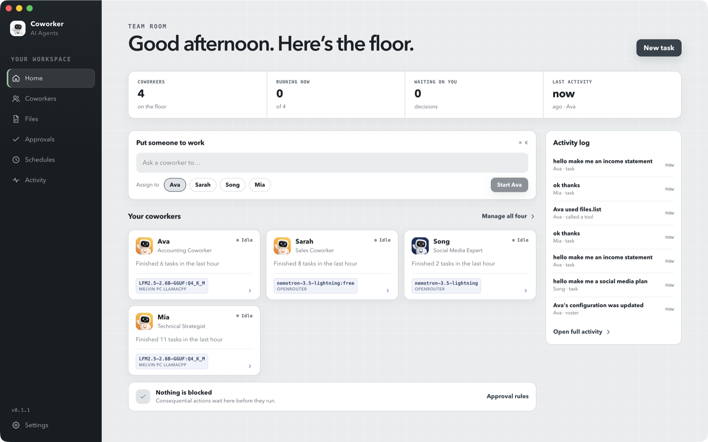
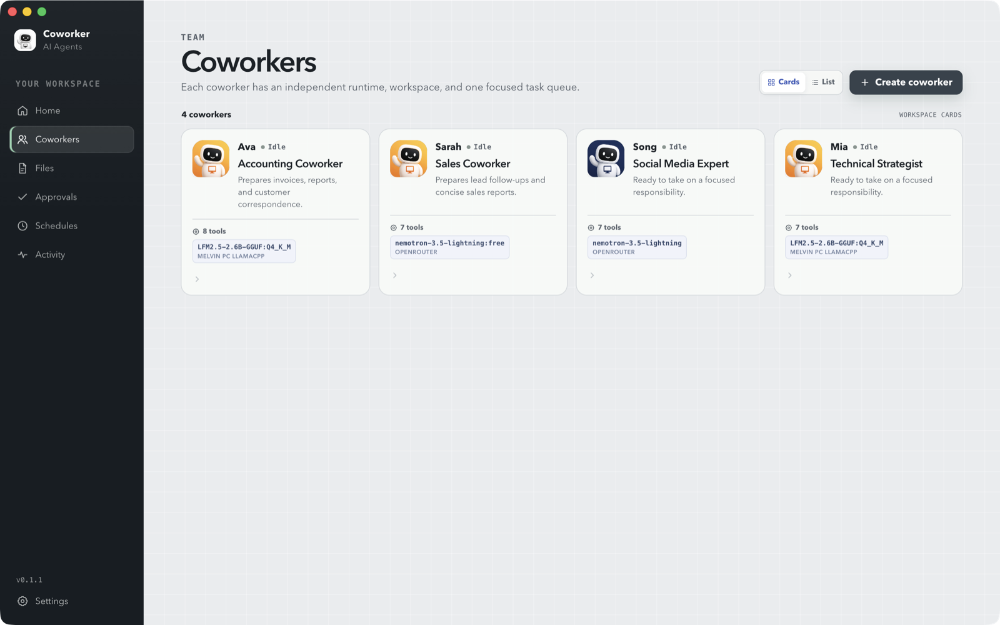
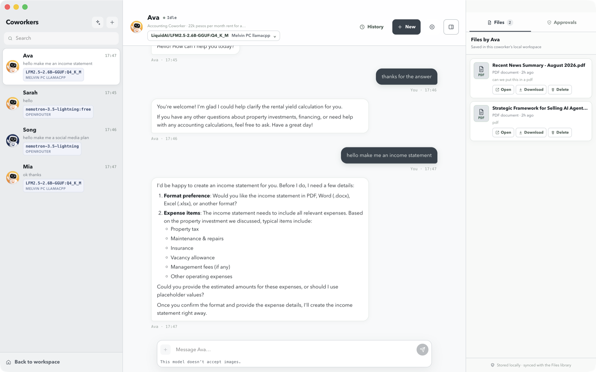
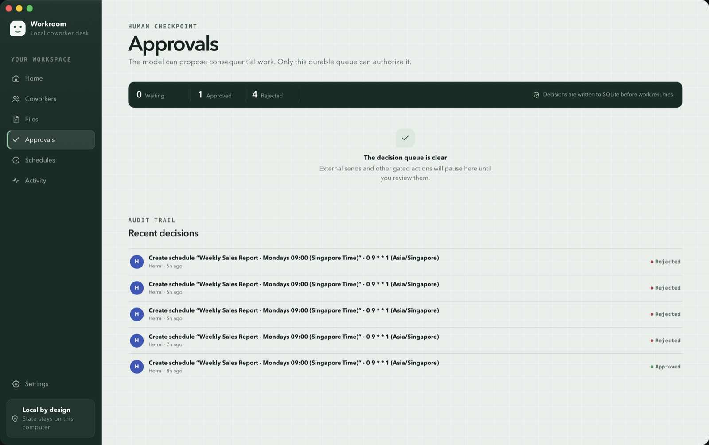

# Coworker

A local-first Electron app for running independent AI coworkers. Each coworker has its own durable task queue, an isolated worker runtime, a confined workspace, and policy-controlled tools — so it can do real work (documents, invoices, email drafts, scheduled reminders) without arbitrary code execution.

## Download

Prebuilt installers for macOS, Windows and Linux are attached to every
[GitHub release](https://github.com/donvito/coworker/releases/latest).

| Platform | File |
| --- | --- |
| macOS (Apple silicon) | `Coworker-<version>-mac-arm64.dmg` |
| macOS (Intel) | `Coworker-<version>-mac-x64.dmg` |
| Windows | `Coworker-<version>-win-x64-setup.exe` (also `arm64`) |
| Linux | `Coworker-<version>-linux-x64.AppImage` or `.deb` |

The builds are not code-signed yet, so the OS warns on first launch:

- **macOS** — right-click the app and choose *Open*, or run
  `xattr -dr com.apple.quarantine "/Applications/Coworker.app"`.
- **Windows** — SmartScreen: *More info* → *Run anyway*.
- **Linux** — `chmod +x Coworker-*.AppImage` before running it.

## Screenshots

**Workroom home** — every coworker's runtime status, the decision queue, and a live desk log.



**Coworkers** — each one has an independent runtime, workspace, and single focused task queue.



**Chat** — streaming replies, typed tool calls, and the files a coworker writes into its own workspace.



**Approvals** — consequential actions pause here, and decisions are written to SQLite before work resumes.



## Quick start

Requires **Node.js 22.12+** and **pnpm**.

```sh
pnpm install
pnpm dev
```

The app ships with two demo coworkers — **Ava** (accounting) and **Sarah** (sales) — that run on a built-in faux provider, so you can try the full flow without an API key.

To connect a real model, open **Settings → Providers**, add credentials, and verify the provider. Supported: Anthropic, OpenAI, Google, OpenRouter, Ollama, LM Studio, and any custom OpenAI-compatible endpoint. Ollama (`http://127.0.0.1:11434/v1`) and LM Studio (`http://127.0.0.1:1234/v1`) work without an API key.

### Scripts

| Command | What it does |
| --- | --- |
| `pnpm dev` | Run the app in development |
| `pnpm typecheck` | TypeScript check, no emit |
| `pnpm build` | Typecheck + production build |
| `pnpm test` | Build, then run the integration suite |
| `pnpm eval:contract` | Run the deterministic agent evals |
| `pnpm package` | Build an unpacked app into `release/` |
| `pnpm dist` | Build installers for the current platform into `release/` |
| `pnpm dist:mac` / `dist:win` / `dist:linux` | Build installers for one platform |

`pnpm test` builds the production worker first, then verifies queue isolation, concurrent workers, approval pause/resume, idempotency, scheduler recovery, and workspace confinement.

## Features

**Coworkers and chat**
- Multiple coworkers, each with its own role, system prompt, tool set, and workspace
- Multiple named conversations per coworker, persisted across restarts
- Streaming, Markdown-rendered replies with typed tool call rendering
- Image attachments via picker or drag-and-drop, sent to vision-capable models
- Searchable live model catalogs with OpenRouter pricing and quick per-coworker model switching

**Work execution**
- One task at a time per coworker, on an isolated Node worker thread
- Durable SQLite task queue with checkpoints, history, artifacts, and crash recovery
- Approval inbox with editable decisions and idempotent resume
- Persistent cron and one-time schedules; chat reminders route to the approval-gated scheduler

**Tools**
- Confined file read/list/write inside the coworker workspace
- Invoice creation
- Document export to PDF, Word DOCX, Excel XLSX, and CSV from semantic Markdown
- Email drafts (`.eml` outbox by default) and approval-gated sending via Resend
- Web search with Tavily, Exa, Firecrawl, and SerpAPI credential fallback

**Skills**
- Agent Skills-compatible global skill library with per-coworker enablement
- Bundled `web-search` and `document-authoring` skills
- Install by uploading a `SKILL.md`, from an HTTPS URL in Settings, or by pasting a skill URL into chat
- Metadata is exposed to the model first; full instructions load on demand through a controlled skill reader

**Platform**
- Tray/background operation and launch-at-login controls
- electron-builder packaging for macOS, Windows, and Linux
- OS-backed encrypted model and integration credentials

## Agent evals

The Vitest Evals suite exercises production worker threads and controlled tools, not mocked agent facades. It is split by what each suite can honestly measure.

**Contract evals** (`evals/tool-safety`, `evals/multimodal`) assert deterministic policy: path confinement, malformed tool input, approval gating, idempotent side effects, and image validation. No model is involved, so these gate every push.

```sh
pnpm eval:contract      # keyless, deterministic — the CI gate
pnpm eval:report:contract   # also writes eval-results/latest.json
pnpm eval:ui            # browse the report
```

**Behavior evals** (`evals/coworker-behavior`) assert model judgment: which controlled tool the coworker reaches for, and in what order. Grading that against a scripted stand-in would only measure the script, so each scenario runs against a real provider once and replays the recorded turns afterwards.

Recordings live in `evals/recordings/` and are currently **local and gitignored**, so these evals skip in CI rather than gate it. Committing that directory is what turns them into a CI gate; until then they are a local tool.

```sh
pnpm eval:behavior      # replay the committed recordings

EVAL_PROVIDER=openai \
EVAL_MODEL=gpt-4.1-mini \
EVAL_API_KEY=... \
pnpm eval:record        # re-record against a live provider
```

A scenario with no recording and no live provider is skipped, never graded against a stand-in. Re-record whenever a prompt, tool surface, or system prompt changes — a stale recording is a stale claim about the model.

A scenario marked `liveOnly` never replays. Its recorded turns reference an identifier the app generated during recording (an invoice number derives from a per-run task id), which a replay regenerates differently, so replaying it would assert nothing.

`EVAL_PROVIDER` accepts `anthropic`, `openai`, `google`, or `openrouter`. A provider-specific key (`ANTHROPIC_API_KEY`, `OPENAI_API_KEY`, `GOOGLE_API_KEY`, `OPENROUTER_API_KEY`) can be used instead of `EVAL_API_KEY`. Live runs may incur provider charges; the contract suite never makes remote calls.

## Data and security

State lives under Electron's user-data directory. Model and email API keys are encrypted with Electron `safeStorage` — plaintext keys are never written to SQLite or returned to the renderer.

The renderer runs with context isolation, sandboxing, no Node integration, a restrictive CSP, and a narrow preload API. Workers cannot touch SQLite or credentials directly. File tools resolve paths against the coworker's workspace and reject traversal or escaping symlinks. Attached images are validated and capped at four images / 20 MB per message. Remote skill downloads reject credential-bearing, local, and private-network URLs, and bundled skills cannot be overwritten. There is deliberately no shell, Python, or code-execution tool.

Provider, catalog, startup, inference, and runtime-exit failures are written as redacted JSON Lines to `logs/provider-errors.jsonl` in the same directory (provider/model and task/run IDs, no prompts or credentials; rotates at 5 MB). Recent entries are viewable in **Settings → Data**, where a redacted support report can be copied or exported.

## Releasing

Installers are built by [`.github/workflows/release.yml`](.github/workflows/release.yml)
on a matrix of macOS, Windows and Ubuntu runners, then attached to a GitHub release.

```sh
# bump "version" in package.json first
git tag v0.1.0
git push origin v0.1.0
```

Pushing a `v*` tag builds all three platforms and publishes the release. Re-running the
workflow manually (**Actions → Release → Run workflow**) with an existing tag rebuilds it
and re-uploads the assets to the same release.

Nothing in the dependency tree is native — the database is `node:sqlite` — so each runner
packages its own platform without a rebuild toolchain. Signing is not configured: add
`CSC_LINK`/`CSC_KEY_PASSWORD` (macOS) and `WIN_CSC_LINK`/`WIN_CSC_KEY_PASSWORD` (Windows)
as repository secrets, and drop `identity: null` from `build.mac`, once certificates exist.

## Contributing

New coworker capabilities are delivered as Agent Skills rather than hardcoded application logic. See [AGENTS.md](AGENTS.md) for the capability architecture and verification expectations.
