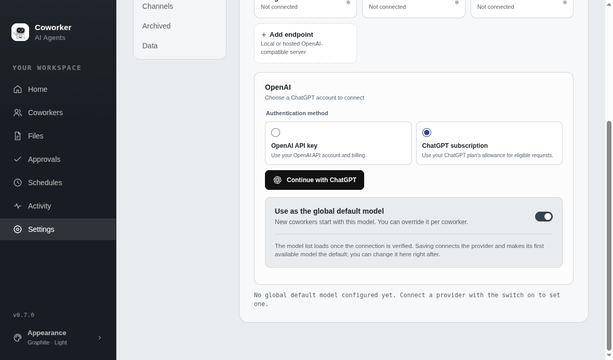
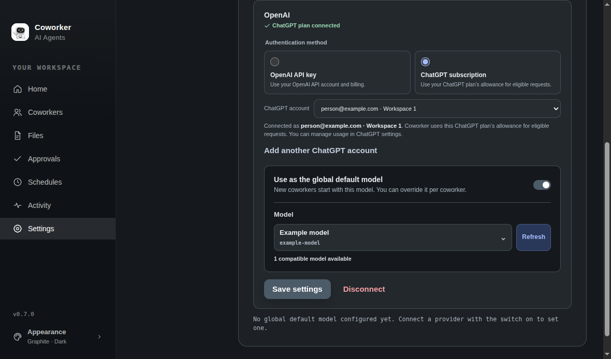
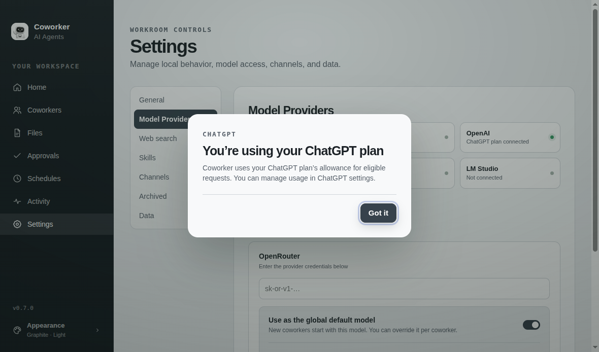
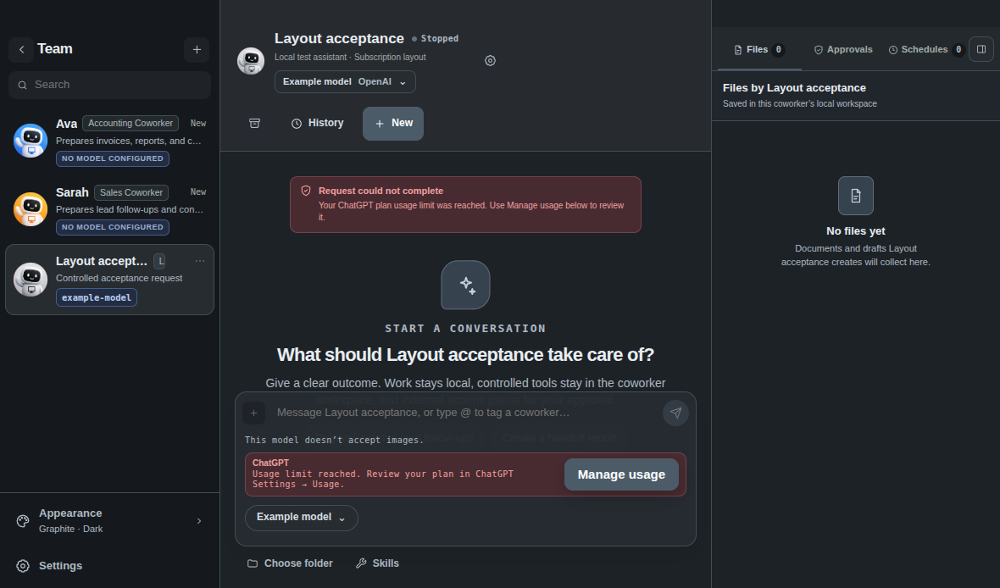

# ChatGPT subscription sign-in

Branch: `feat/chatgpt-sign-in`

## Research and architecture

Reviewed the official [registration and sign-in](https://developers.openai.com/siwc/token-sharing-open-source/sign-in), [accounts and sessions](https://developers.openai.com/siwc/token-sharing-open-source/profiles-and-sessions), [models and inference](https://developers.openai.com/siwc/token-sharing-open-source/models-and-inference), [preview limitations](https://developers.openai.com/siwc/token-sharing-open-source/preview-limitations), and [UI guidelines](https://developers.openai.com/siwc/ui-ux-guidelines) on 2026-10-03.

Authentication is an application credential boundary under [AGENTS.md](../../AGENTS.md). Pi still selects skills and runs the agent loop; controlled tools, durable approvals, scheduling, and workspace confinement retain their existing boundaries. This integration does not introduce an agent skill or replace Pi with Codex app-server.

Keep the existing OpenAI provider with explicitly selected API-key and ChatGPT-subscription modes. Store API keys separately from account registrations and rotating OAuth credentials. Subscription errors must never select another billing method automatically.

The main process owns loopback authorization, persistent installation identity, signed identity validation, encrypted credential storage, account selection, revocation, and serialized refresh. Workers request a fresh usable access token before every inference, including tool continuations and approval resumes. Renderer APIs expose connection metadata only. Account and credential changes must stop the old workers before replacing their configuration and preserve the established recovery behavior.

Use the public Responses endpoint with streaming, client-managed history, and account-specific model discovery. Apply the documented subscription restrictions at the request boundary and require a completed terminal response before reporting success. Reuse Pi's Responses serialization and event parsing where compatible. Its installed OAuth helper hardcodes the Pi registration name and does not validate ID-token identity; Coworker supplies its own narrow authentication service.

## Acceptance requirements

- Preserve the existing provider cards, inline settings form, notices, model picker, default switch, and disconnect confirmation. Use approved sign-in branding and review minimum-size light and dark layouts.
- Keep experiments in the development profile; preserve the production profile and previous installer for rollback.
- Test OAuth failures and cancellation, restart persistence, rotating-token concurrency, account switching, disconnect, model discovery, request formatting, and credential redaction.
- Exercise real workers with controlled inference fixtures for tools, approvals, cancellation, scheduled work, and a shared login. Report fixtures separately from live subscription results.
- Run `pnpm test`, `pnpm eval:contract`, and `pnpm test:cli:smoke` manually. The current eval workflow has only `workflow_dispatch`; absence of CI checks is not a passing check.
- Verify live sign-in, conversation, controlled tool action, approval resume, restart, and continuation on the Zenbook before calling the feature complete.
- Build and smoke-test the Linux installer using the existing packaging scripts. Follow [Releasing](../releasing.md) for a maintainer version bump and release; a contribution branch does not publish a release.

## Baseline

Upstream revision: `4d40046ae6d924787375edb84cbfd372937f31e6`. Zenbook: Ubuntu 24.04.5 LTS, x86-64, passwordless installation access. Toolchain: Node 24.19.0 and the repository's pinned pnpm 9.15.0.

Before changes, frozen installation and the production build passed. `pnpm test` passed 627 of 628 tests: the existing differently-cased workspace-root test in `tests/artifact-files.test.ts` fails on Linux, where the differently cased path refers to a different directory. `pnpm eval:contract` passed all 13 checks. `pnpm test:cli:smoke` passed using real Electron and an isolated profile.

Installed the official stable 0.7.0 amd64 Debian package after matching its SHA-256 to GitHub's published asset digest. Startup and a credential-free demo conversation passed in the normal production profile. The stable installer and a closed-profile copy were retained outside the repository for rollback. Development uses the existing separate `Coworker Development` profile.

An isolated Electron check confirmed that this Zenbook has encrypted credential storage available through `gnome_libsecret`. Subscription credentials are not accepted with Electron's unprotected Linux `basic_text` backend.

Playwright's unpackaged Electron loader forces `--password-store=basic`. The live acceptance harness restores the supported GNOME backend before app startup; its development-profile check then reports encryption available through `gnome_libsecret`. This is test instrumentation outside the app, not a change to production credential policy. Run unpackaged checks from the repository directory so the existing bundled-skill resolver finds `skills/`.

## Implementation and validation

The feature is implemented on the focused branch. The main-process service validates browser authorization and signed identity, preserves issued registrations, protects rotating credentials, and exposes connection metadata. The OpenAI provider selects one access method explicitly. Pi's public Responses integration is adapted at the subscription request boundary; existing skills, controlled tools, approval checkpoints, and schedules remain in use.

Manual feature validation on Ubuntu x86-64:

| Check | Result | Evidence boundary |
| --- | --- | --- |
| `pnpm test` | 680 / 680 passed across 92 files | Unit, integration, renderer, and real-worker fixtures |
| `pnpm eval:contract` | 13 / 13 passed | Tool and multimodal safety contracts; no live model |
| `pnpm test:cli:smoke` | Passed | Real development Electron, isolated profile |
| OAuth lifecycle | Passed | Signed local token fixtures: invalid state/PKCE/identity, permission denial, cancellation, expiry, refresh serialization/rotation, transient errors, revoked grants, restart, switching, and revocation |
| Subscription worker behavior | Passed | Actual Pi workers with local Responses streams: tools, durable approval/resume, cancellation, account switch during startup and inference, shared login, scheduled queues, quota recovery, and credential redaction |
| Settings and composer | Passed | Synthetic public connection metadata; 1180 × 760 and 1560 × 980, light and dark; no overflow or clipped controls, keyboard focus contained/restored |
| Live ChatGPT subscription | Pending | System browser authorization opened, but the attempt timed out without a callback; no signed-in account or live inference result |
| Linux installer | Passed | Built and installed amd64 Debian package; real packaged CLI smoke, settings controls, encrypted GNOME storage, demo conversation, and restart persistence in isolated profiles |

The worker fixtures caught a startup cancellation race: stopping a worker while catalog discovery waited for a token could leave its claimed task running indefinitely. Startup now races discovery against physical worker exit, and interrupted dispatch reschedules the requeued task even when account-change recovery resumed first. Nested dispatch pauses retain all outstanding pause boundaries.

A quota error pauses automatic work for the selected account, including other coworkers using it. Only an explicit desktop request can test recovery; its exact task is claimed without running older queued automation first. Successful subscription inference releases the pause. Restart retains the pause from durable task failures. No path selects API-key billing automatically.

The current evaluation workflow is manual-only; these results came from commands run locally. They do not establish live account eligibility, OpenAI endpoint interoperability, live renewal, or actual subscription quota behavior. Windows and macOS installer checks were not run.

The pre-existing Linux test failure was corrected by asserting that a differently cased workspace path is rejected on Linux. macOS and Windows retain the existing case-insensitive expectation. The production confinement code was unchanged; the focused artifact suite passed after this test correction.

## Settings screenshots

These captures use synthetic account and model labels, with no OAuth credentials or live account data. The welcome dialog was captured after its entrance animation settled. Source and screenshot reviews followed the existing settings layout and typography.

## Remaining acceptance

Complete browser sign-in and plan-usage consent on the Zenbook. Then select a model from that account's catalog, finish a small conversation, approve one controlled local file write, restart, and continue the conversation. Keep this check in the development or another dedicated acceptance profile. Record live results separately from the passing fixtures before marking the contribution ready.

The contribution retains version 0.7.0. A maintainer version bump, release notes, and release tag follow the existing release process after review; no release is published by this branch.

## Zenbook installer and rollback

Built the amd64 Debian target with the existing electron-builder configuration after the passing production build. The first attempt failed during Debian archive assembly while disk space was tight. Retrying the same prepackaged output with temporary files under a RAM filesystem succeeded; no application or packaging configuration was changed for this retry. Installation with `dpkg` passed.

Feature installer SHA-256: `5b37b76f24a6e1e9fec23e392dc695071575225aca5b8d13e022ecdfdf4c6585`.

The installed executable passed the existing CLI smoke harness with `COWORKER_SMOKE_EXECUTABLE=/opt/Coworker/coworker`. A separate real packaged-window check verified the new settings controls, encrypted `gnome_libsecret` storage, a completed built-in demo conversation, and persistence of both the completed task and selected access method after restart. This check used an isolated temporary profile and made no subscription inference calls.

The previous official installer (SHA-256 `15b25e9c42e06960f2e40549b50dc91bba11b166461aa0440f9d7d7a8a916f22`) and a copy of the closed normal profile are retained in the local validation directory outside source control. Reinstall that official package to roll back the executable; restore the closed-profile copy only if profile recovery is needed. The feature installer has the unchanged contribution version 0.7.0 and is distinguished by its digest.
